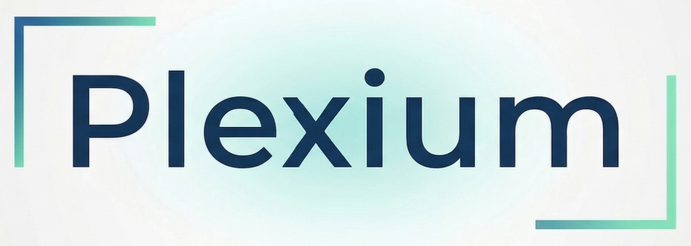

<p align="center">
  
</p>

<p align="center">
  <a href="LICENSE"></a>
  <a href="https://go.dev"></a>
  <a href="docs/status.md"></a>
  <a href="https://deepwiki.com/Clarit-AI/Plexium"></a>
  
</p>

<p align="center">
  Plexium gives your repository a persistent, agent-maintained wiki that compounds with every commit.
</p>

---

## What Plexium Is

Plexium is a repo memory system for human developers and coding agents. It does not replace your source code or your existing docs. It adds a durable knowledge layer beside them: a `.wiki/` vault that agents can read before they work, update after they work, and query later through CLI or MCP instead of rebuilding context from scratch every session.

The short version is simple: LLM agents are good at coding, but they are terrible at remembering. Plexium turns that repeated rediscovery into a shared project memory that can compound over time.

## What Happens When You Install It

When you run Plexium in a repository, it creates two project-local surfaces:

- `.wiki/` becomes the durable knowledge layer: pages, navigation, change log, raw source material, and agent instructions.
- `.plexium/` becomes the control plane: config, manifest, templates, reports, integrations, and generated instruction files for agents.

From there, Plexium gives you three ways to use that memory:

- read and maintain it as a browsable wiki in GitHub Wiki or Obsidian
- retrieve answers from it with `plexium retrieve` or PageIndex over MCP
- keep it in sync with your code through hooks, CI, and optional background automation

Plexium is also deliberately **per repository**. You install the `plexium` binary once on your machine, but you run `plexium init` or `plexium setup <agent>` inside each repository you want Plexium to manage. It does not silently apply itself to every repo on your machine.

> Core vs optional:
> The core product is the wiki, manifest, compile/lint flow, and retrieval CLI. MCP setup, marketplace plugins, daemon automation, Ollama/OpenRouter providers, and Memento ingestion are optional layers you can add when you want more leverage.

## How It Works In Practice

The day-to-day loop looks like this:

1. A user or agent retrieves context from the wiki instead of starting cold.
2. Code changes happen in the normal repo workflow.
3. Plexium updates or validates the wiki, navigation, and state manifest.
4. Hooks and CI catch drift so the memory stays aligned with the codebase.

That means Plexium is not just a wiki generator. It is a system for keeping project understanding durable, queryable, and enforceable while real work is happening.

## Major Capability Layers

### Wiki Memory Layer

Plexium stores durable project understanding in `.wiki/`: architecture pages, module pages, ADRs, concepts, guides, log entries, contradictions, and raw source material. Agents read it before they work and write back to it after they work.

### Retrieval Layer

Plexium includes a built-in retrieval engine over the wiki. You can query it directly from the CLI with `plexium retrieve "query"`, or expose the same engine over MCP with `plexium pageindex serve` so Claude, Codex, or other agents can pull relevant wiki context inside their own sessions. The marketplace/plugin bundles wrap that same retrieval surface instead of inventing a second system.

If you want the raw MCP setup path, use:

```bash
plexium pageindex connect claude
plexium pageindex connect codex
```

If you want Plexium to guide the repo setup and optionally write the native MCP config for you, use:

```bash
plexium setup claude --write-config
plexium setup codex --write-config
```

### Automation Layer

Plexium can stay passive, or it can stay alive while you code. Git hooks can enforce that wiki changes accompany source changes. CI can check coverage at PR time. The daemon can watch for stale pages, lint issues, and wiki debt. Claude and Codex integrations keep setup, verification, retrieval, and MCP wiring on a single happy path instead of making users memorize the raw commands.

### Assistive Layer

If you want autonomous wiki upkeep, Plexium can route maintenance work to local or remote model providers. Ollama is the zero-cost local path. OpenRouter or another OpenAI-compatible endpoint is the remote path. This layer is optional: the core wiki and retrieval workflow do not require a paid provider. We recomend using highly capable - low cost models that work well be it in the cloud or on-prem. Our current top picks are google/gemma-4-26B-A4B-it, Qwen/Qwen3.5-35B-A3B and nvidia/Nemotron-Cascade-2-30B-A3B.

Plexium now stores assistive behavior in an editable prompt pack under `.plexium/prompts/`, with simple capability profiles such as `constrained-local`, `balanced`, and `frontier-large-context`. That lets teams tune how aggressive or conservative the assistive layer should be without editing Go code.

### Transcript and Provenance Layer

When Memento is enabled, Plexium can treat session transcripts as raw source material instead of letting rationale vanish after the commit lands. That gives the assistive layer access to design intent, tradeoffs, and decision history that ordinary code scans miss.

## Why Plexium Is Different

Plexium is shaped by the LLM Wiki idea, but it goes further in a few important ways:

- It uses a deterministic manifest, compile, and lint model instead of relying on best-effort wiki generation alone.
- It gives agents a native retrieval layer through CLI, MCP, and marketplace/plugin surfaces, not just static pages.
- It can actively maintain knowledge through hooks, CI, and background automation instead of waiting for humans to remember.
- It can ingest Memento session history so rationale and tradeoffs have a path into the wiki, not just the final code diff.

## Quick Start

**Plexium is per-repo.** Install the binary once, then run the setup commands below inside each repository you want to instrument.

**Prerequisites:**
- [Go 1.25+](https://go.dev/dl/)
- Git
- A Git repository
- Optional: [git-memento](https://github.com/mandel-macaque/memento) for session provenance. If you opt into it with `--with-memento`, Plexium can offer to install it for you.

### Binary-first

```bash
go install github.com/Clarit-AI/Plexium/cmd/plexium@latest

cd /path/to/your/repo
plexium setup claude
# or
plexium setup codex

plexium verify claude
# or
plexium verify codex
```

Add `--write-config` if you want Plexium to run the native MCP configuration command for you. Add `--with-memento` if you also want repo-local session provenance:

```bash
plexium setup claude --write-config --with-memento
plexium setup codex --write-config --with-memento
```

After setup, the next default move is `plexium convert`. Setup wires the tooling, retrieval, MCP path, and agent instructions; `convert` turns the starter scaffold into a useful first-pass wiki. If no assistive provider is configured yet, Plexium now offers Ollama/OpenRouter setup during onboarding and otherwise falls back cleanly to `convert` plus your main coding agent.

For Claude Code, Plexium also installs a temporary repo-local Memento compatibility shim while upstream `git-memento` catches up with Claude's current session model.

### Claude Code marketplace

```text
/plugin marketplace add Clarit-AI/Plexium
/plugin install plexium-tools@clarit-ai
/plexium-install
/plexium-setup
```

Use `/plexium-setup-auto` when you want the plugin to apply the Claude MCP configuration automatically.

### Codex marketplace

Claude supports a true remote marketplace install from the Plexium GitHub repository today. Codex is not there yet: the current Codex plugin flow still uses the repo-local marketplace entry in `.agents/plugins/marketplace.json` until self-serve remote publishing to the official Codex Plugin Directory is available.

For the full walkthrough, see [Getting Started](docs/getting-started.md).

## Origins and Influences

Plexium pulls together four ideas: Karpathy's LLM Wiki as the conceptual starting point, OpenAI Symphony as the orchestration influence, PageIndex as the retrieval pattern, and Memento as the provenance layer. The interesting part is not just that these projects are cited, but how Plexium combines them into one repo-native system.

Read the full breakdown in [Inspirations](docs/inspirations.md).

## Read More

- [How Plexium Works](docs/how-it-works.md)
- [Retrieval and MCP](docs/retrieval-and-mcp.md)
- [Automation and Hooks](docs/automation-and-hooks.md)
- [Assistive Prompts](docs/assistive-prompts.md)
- [Memento Integration](docs/memento-integration.md)
- [Inspirations](docs/inspirations.md)
- [Getting Started](docs/getting-started.md)
- [User Guide](docs/user-guide.md)
- [CLI Reference](docs/cli-reference.md)
- [Implementation Status](docs/status.md)

## Secret Safety

Never paste API keys, tokens, or other secrets into an AI chat window. In Plexium workflows, that is especially important when Memento is enabled, because session context can later be attached to commits as git notes or copied into raw transcript material.

Prefer terminal-native flows such as:

```bash
export OPENROUTER_API_KEY="sk-or-v1-..."
plexium agent setup
```

If a secret was already pasted into chat, rewind that session if possible and do not commit its Memento note.

## Ecosystem

Plexium is part of the [Clarit.AI](https://github.com/Clarit-AI) open-source ecosystem. Plexium solves agent amnesia at the repository knowledge layer: it gives agents a persistent, shared understanding of the codebase that compounds across sessions. [Engram](https://github.com/Clarit-AI/Engram) approaches memory at the conversation and inference layer. [Synapse](https://github.com/Clarit-AI/Synapse) approaches it at the hardware layer with hybrid NPU/CPU routing for edge devices.

## Contributing

See [CONTRIBUTING.md](CONTRIBUTING.md) for build instructions, testing, and PR workflow.
