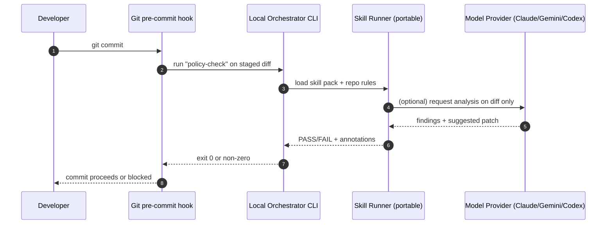
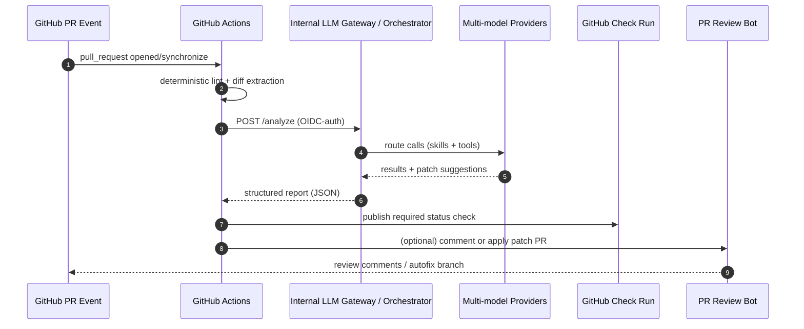
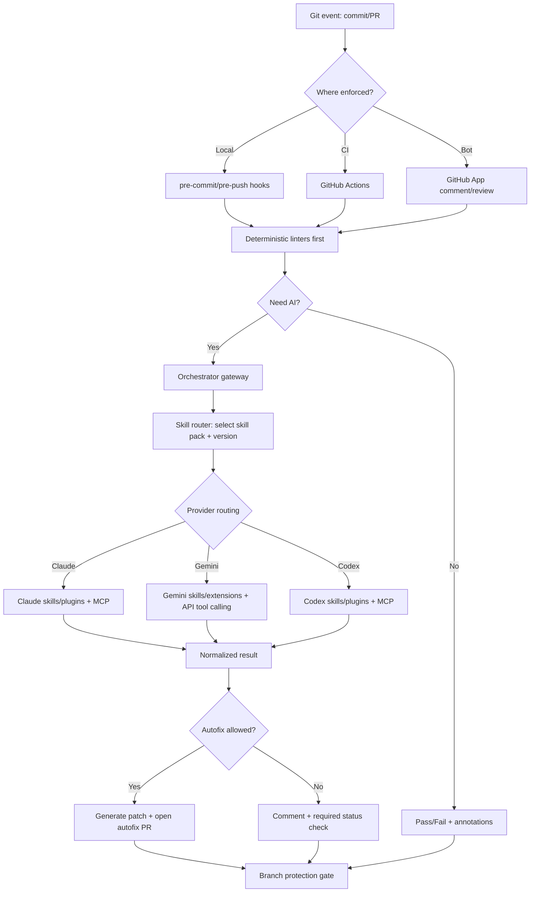

# Reusable Multi‑Model Skill Automation Inspired by Karpathy’s LLM Wiki

## Executive summary

Andrej Karpathy’s newest “artifact” appears to be the **LLM Wiki** “idea file” published as a entity["company","GitHub","code hosting platform"] Gist on **April 4, 2026**. citeturn1view0 The file proposes a practical pattern: keep **raw sources immutable**, have an LLM **incrementally maintain a persistent, interlinked markdown “wiki” layer**, and drive behavior via a **schema/config file** (explicitly naming `CLAUDE.md` for Claude Code and `AGENTS.md` for Codex). citeturn1view0 A local copy of that text was provided in this conversation. fileciteturn0file0

Because the request said the artifact was “unspecified,” this report makes two explicit assumptions:

1) The “recently released artifact” primarily refers to **LLM Wiki** (April 2026). citeturn1view0  
2) The closely preceding **AutoResearch** repository (March 2026) is included as a secondary, relevant artifact because it operationalizes similar themes: “programming the agent with markdown,” fast feedback loops, and Git-centric iteration. citeturn3view0

The reusable automation strategy that best fits your integration goals (Claude skills marketplaces + Gemini skills + OpenAI Codex skills/plugins + Git enforcement) is a **contract-first orchestrator** that treats “skills” as portable, versioned assets, and uses Git events (local hooks + CI + PR bot) as the *enforcement bus*. The key leverage point is that all three ecosystems (Claude Code, Gemini CLI, Codex) now converge on a shared “Agent Skills” folder format with **YAML frontmatter + progressive disclosure**, and all three can be complemented by **Model Context Protocol (MCP)** for tools/data connectivity. citeturn5view0turn13view2turn15view0turn16view0turn4search15turn4search20turn16view2turn11view0

## Karpathy artifact catalog and licensing constraints

### Primary artifacts and what they contribute

The **LLM Wiki Gist** is an explicitly “copy‑paste” idea file describing a three-layer knowledge architecture: (1) **raw sources** (immutable), (2) **wiki** (LLM-generated markdown pages), and (3) a **schema** document that defines structure and operational conventions. citeturn1view0 It also defines three operations—**ingest, query, lint**—and suggests two “indexing/logging” files (`index.md` and `log.md`) to keep the wiki navigable and chronologically auditable. citeturn1view0

The **AutoResearch** repository is a minimal agentic experimentation loop: an agent edits a constrained file, runs a fixed-time experiment, checks a metric, and keeps or discards changes. It explicitly frames the human’s role as writing the agent “org” guidance in a markdown file (`program.md`). citeturn3view0 This is directly relevant to Git-based enforcement because it shows a disciplined pattern for **bounded autonomous modification** and “keep/revert” behavior under a measurable objective. citeturn3view0

### Official sources and constraints table

| Artifact | Official location | Published / updated | What it is | License signal (as published) | Practical constraint for reuse |
|---|---|---:|---|---|---|
| LLM Wiki | GitHub Gist `karpathy/llm-wiki.md` citeturn1view0 | Apr 4, 2026 citeturn1view0 | “Idea file” for persistent markdown wiki maintained by an LLM citeturn1view0 | **No explicit license text in the file** (no “license” string found) citeturn10view1 | Treat redistribution/commercial reuse conservatively (seek explicit permission or keep usage internal); “copy‑paste” intent is not, by itself, a license grant. citeturn1view0turn10view1 |
| AutoResearch | `karpathy/autoresearch` repo citeturn3view0 | March 2026 (repo README header) citeturn3view0 | Agent runs iterative ML experiments; human writes `program.md` | README says **MIT** citeturn3view0 | Verify whether a standalone LICENSE file exists before downstream compliance; repo issues indicate prior confusion when LICENSE file missing even if README states MIT. citeturn2search13turn3view0 |

### Visual grounding of the artifacts

image_group{"layout":"carousel","aspect_ratio":"16:9","query":["karpathy llm-wiki gist","karpathy autoresearch github repository","Andrej Karpathy autoresearch program.md"],"num_per_query":1}

### Direct official links (for quick access)

```text
LLM Wiki (Gist): https://gist.github.com/karpathy/442a6bf555914893e9891c11519de94f
AutoResearch (repo): https://github.com/karpathy/autoresearch

Claude Code plugin marketplaces: https://code.claude.com/docs/en/plugin-marketplaces
Claude Agent Skills overview: https://platform.claude.com/docs/en/agents-and-tools/agent-skills/overview
Claude Code hooks guide: https://code.claude.com/docs/en/hooks-guide

Gemini API function calling: https://ai.google.dev/gemini-api/docs/function-calling
Gemini tool combination / context circulation: https://ai.google.dev/gemini-api/docs/tool-combination
Gemini Agent Skills (CLI docs): https://geminicli.com/docs/cli/skills/

OpenAI Codex skills: https://developers.openai.com/codex/skills/
OpenAI Codex plugins: https://developers.openai.com/codex/plugins/
OpenAI Codex MCP server + Agents SDK: https://developers.openai.com/codex/guides/agents-sdk/
GPT Actions overview: https://developers.openai.com/api/docs/actions/introduction/
GPT Store publishing: https://help.openai.com/en/articles/8798878-sharing-and-publishing-gpts
```

## Ecosystem survey of skill and plugin marketplaces

A useful mental model across vendors is now:

- **Skill** = portable workflow knowledge (instructions + optional scripts/assets) loaded on-demand, typically via YAML-frontmatter discoverability and “progressive disclosure.” citeturn5view0turn13view1turn15view0turn16view0  
- **Plugin** = installable bundle that may include skills *plus* tool connectivity (MCP), app connectors, UI metadata, auth hints. citeturn20view0turn20view1turn13view0  
- **Marketplace** = JSON catalog that lists plugins and sources for discovery/install. citeturn13view0turn18view2turn20view0

### Claude: Skills + plugins + marketplaces + hooks

With entity["company","Anthropic","ai company"], “Agent Skills” are filesystem-based resources that provide domain workflows and load on-demand; they’re available across Claude surfaces (Claude.ai, Claude Code, Claude API). citeturn13view1 Anthropic’s own guide defines a skill as a folder containing required `SKILL.md` (with YAML frontmatter) and optional `scripts/`, `references/`, and `assets/`, emphasizing progressive disclosure and composability. citeturn5view0turn13view1

Claude Code adds two marketplace-adjacent capabilities that matter for reusable automation:

- **Plugin marketplaces**: a `marketplace.json` file catalogs plugins; each plugin includes a manifest and can contain skills; users can add/update marketplaces via `/plugin marketplace add` and `/plugin marketplace update`. citeturn13view0  
- **Hooks**: deterministic shell-command hooks that run at lifecycle events (e.g., before/after tool calls), and can be used to format code, block edits to protected files, or audit config changes; explicit “block” outcomes are supported. citeturn14view0

This matters because you can implement **local enforcement** inside Claude sessions (hooks) and **team enforcement** via shared marketplaces (skill distribution).

### Gemini: API tool calling + CLI skills/extensions + MCP for “freshness”

For entity["company","Google","search and cloud company"], two distinct integration surfaces matter:

1) **Gemini API function calling/tool use** (cloud-side): The Gemini API supports function calling (custom tools) and, for Gemini 3 models, can combine built-in tools (e.g., Google Search) with function calling through “tool context circulation.” citeturn17view1turn17view0 The docs highlight that client implementations must preserve and replay specific fields (`id`, `tool_type`, `thought_signature`) to maintain tool context across turns—an important constraint for any “adapter layer.” citeturn17view0  
2) **Gemini CLI extensions + Agent Skills** (developer workstation surface): Gemini CLI skills are explicitly “based on the Agent Skills open standard” and stored as self-contained directories; the CLI supports discovery tiers, including a cross-tool `.agents/skills/` alias intended for compatibility. citeturn15view0 Gemini CLI extensions can include MCP servers, custom commands, context files (`GEMINI.md`), agent skills, and hooks. citeturn15view1 Google’s developer blog emphasizes secure extension configuration, including storing sensitive settings like API keys in the **system keychain** rather than plain text. citeturn11view1

Finally, Google is explicitly promoting **MCP + Skills** together to mitigate outdated agent code, describing a “Gemini API Docs MCP” plus “Gemini API Developer Skills,” with reported evaluation gains when combined. citeturn11view0turn6search10

### OpenAI: Codex skills/plugins/marketplaces + GPT Actions as “plugin equivalent”

For entity["company","OpenAI","ai research company"] there are two complementary extension models:

1) **Codex skills + plugins + marketplaces**: Codex uses “Agent Skills” (folder with `SKILL.md` and optional scripts/references/assets) and explicitly states it builds on an open agent skills standard with progressive disclosure. citeturn16view0 Plugins are the installable unit (with a required `.codex-plugin/plugin.json` manifest) and can bundle skills, app mappings (`.app.json`), and MCP server config (`.mcp.json`). citeturn20view0turn20view1 Codex supports repo-scoped and user-scoped marketplaces at `.agents/plugins/marketplace.json`. citeturn20view0  
2) **GPT Actions** as a “plugin equivalent” for ChatGPT-distributed capability: GPT Actions let a custom GPT call external REST APIs using function calling and can be configured with an auth mechanism like OAuth. citeturn19search16turn7search2 OpenAI also documents how to publish GPTs to the GPT Store. citeturn9search0turn9search5

A cross-ecosystem enabler: OpenAI documents running Codex as an **MCP server** and orchestrating it via an Agents SDK, which is a direct path to a reusable automation control plane. citeturn16view2turn19search10turn19search22

### Other notable marketplaces that affect enforcement integrations

entity["company","Microsoft","software and cloud company"]’s ecosystem influences enforcement primarily through developer surfaces:

- **Copilot Extensions**: introduced as a partner ecosystem and discoverable via GitHub Marketplace; supports invoking external tools/services from Copilot Chat. citeturn18view0turn18view1  
- **Copilot CLI plugins + marketplaces**: GitHub documents that a plugin marketplace is defined by a `marketplace.json` catalog and can live on GitHub or elsewhere; importantly, Copilot CLI also looks for `marketplace.json` in a `.claude-plugin/` directory, an accidental but useful convergence point with Claude-style marketplace layouts. citeturn18view2  
- **VS Code Marketplace**: publishing model for IDE extensions; relevant when your automation needs to “live where developers are.” citeturn9search3turn9search7

### Comparison table: marketplaces, interfaces, auth, and fit for Git enforcement

| Ecosystem | What you distribute | Discovery/install | Primary extension interface | Auth patterns you must plan for | Best fit in a Git enforcement pipeline | Key tradeoffs |
|---|---|---|---|---|---|---|
| Claude Code | Skills + plugins via marketplace catalogs citeturn13view0turn13view2 | `/plugin marketplace add`, then install plugin citeturn13view0 | Skill directories (`SKILL.md`) + hooks (shell/agent/HTTP) citeturn14view0turn5view0 | Claude API skills need specific beta headers; Claude Code runs filesystem-based skills without API upload citeturn13view1 | Local enforcement (hooks) + CI validation using shared skill repo | Great for consistent workflows; need careful sandboxing + file access controls citeturn13view1turn14view0 |
| Gemini | API tools + CLI skills/extensions (+ MCP) citeturn17view0turn15view1turn11view0 | CLI install/link skills; extension install flow; MCP endpoints citeturn15view0turn11view1 | Function calling + built-in tools; “tool context circulation” constraints citeturn17view0turn17view1 | API keys / cloud auth for tools; CLI stores sensitive settings in keychain citeturn11view1 | CI checks that need web grounding; local dev tools with consistent skill packs | Adapter complexity: must preserve tool IDs/thought signatures across turns citeturn17view0 |
| Codex | Skills + plugins + marketplaces (+ MCP) citeturn16view0turn20view0turn16view2 | Plugin directory + `.agents/plugins/marketplace.json` citeturn20view0turn20view1 | Skills + plugin manifests; MCP server mode citeturn16view2turn20view0 | External app terms apply when sending data via connectors citeturn20view1 | Strong for code review/autofix on diffs; MCP is a clean integration boundary | More moving parts (plugins/apps/MCP); must harden approvals/sandboxing citeturn16view2turn20view1 |
| ChatGPT GPT Store | Custom GPTs + Actions | Publish/share GPTs citeturn9search0turn9search8 | OpenAPI Actions (function calling) citeturn19search16turn7search6 | OAuth (client ID/secret etc), secrets stored encrypted citeturn7search2turn7search10 | Useful for human-in-the-loop review UX, not great as hard gate | Product UX is strong; CI determinism + reproducibility are harder than CLI-based checks |

## Reference architectures for multi-model automation with Git hooks and GitHub Actions

The core decision is where “truth” lives and where enforcement happens. Karpathy’s LLM Wiki pattern implicitly recommends putting the **persistent artifact** (the wiki) into a **Git repo** (“the wiki is just a git repo of markdown files”). fileciteturn0file0 From there you can enforce quality with standard Git lifecycle points.

### Architecture option space

**Option A: Local-first (developer workstation)**  
- Use **pre-commit hooks** for fast, deterministic checks (formatting, schema validation, unsafe diff detection). Git documents that `pre-commit` runs before commit creation and can abort the commit; it can also be bypassed with `--no-verify`. citeturn8search8turn8search0  
- Invoke “skills” locally via Claude Code / Gemini CLI / Codex CLI (or your orchestrator calling APIs).  
- Best for tight feedback loops, but not enforceable (developers can bypass). citeturn8search8

**Option B: CI-first (GitHub Actions + required checks)**  
- Rely on **GitHub Actions** + **protected branches** with **required status checks** so merges are blocked unless your automation passes. citeturn8search2turn8search6  
- Implement checks as: (1) deterministic linters, then (2) AI “skill checks” only when needed, and (3) optional autofix PRs.  
- Best for enforcement and auditability; costs more.

**Option C: Hybrid (recommended for reusable automation)**  
- Local pre-commit provides fast feedback. CI is the enforcement gate. A PR bot adds UX (comments, suggested patches, autofix branches).  
- This aligns with GitHub’s model: local hooks are advisory; required checks create hard gates. citeturn8search8turn8search2

### Concrete enforcement points

- **pre-commit / pre-push hooks**: best for “cheap signals” and preventing obvious mistakes (e.g., secrets, broken formatting). citeturn8search8turn8search11  
- **server-side hooks (pre-receive/update)**: available in self-hosted Git; Git documents many hook types and their behavior. citeturn8search0turn8search14  
- **GitHub Actions checks**: canonical enforcement mechanism for GitHub hosted repos. Required checks must pass before merging into protected branches. citeturn8search2  
- **PR bot (GitHub App)**: subscribe to webhook events and post review comments or statuses (e.g., `pull_request_review_comment`). citeturn8search3turn8search7

### Security and authentication in CI

Use GitHub’s recommended approach: **OIDC-based short-lived identity** instead of long-lived cloud secrets when Actions needs to call internal services. GitHub documents that OIDC allows workflows to access cloud resources without storing long-lived secrets as GitHub secrets. citeturn8search1turn8search5

Where LLM API keys are needed, prefer an internal “LLM gateway” service so that:
- GitHub Actions authenticates to *your* gateway via OIDC.
- The gateway holds vendor credentials and enforces budgets/rate limits centrally.
- You can implement policy (what data can be sent to which model) in one place.

### Sequence diagram: Local pre-commit gate (fast feedback)



### Sequence diagram: PR enforcement with GitHub Actions + PR bot



## Reusable patterns, schemas, and observability

### Design pattern: “Skill Adapter Layer” + “Marketplace Normalization”

All three target ecosystems now support a directory-based skill standard with progressive disclosure:

- Claude skill folder definition + progressive disclosure described in Anthropic’s guide. citeturn5view0turn13view1  
- Gemini CLI skills are explicitly based on the same open standard, and even provide a `.agents/skills/` alias for cross-tool compatibility. citeturn15view0  
- Codex skills likewise follow the open standard; plugins are the installable unit. citeturn16view0turn20view0

**Practical reusable approach:** keep one canonical skill repository in Git, then generate vendor-specific packaging (plugin manifests + marketplace catalogs) as build artifacts.

A strong “lowest common denominator” directory shape:

- `skills/<skill-name>/SKILL.md`
- optional `scripts/`, `references/`, `assets/`

Then layer tool-specific metadata using optional files (e.g., Codex `agents/openai.yaml`) or plugin manifests where needed. citeturn16view0turn20view0turn5view0

### Design pattern: MCP-first tool connectivity

MCP is positioned as a vendor-neutral “USB‑C port for AI applications,” connecting models to tools/data sources via a standard protocol. citeturn4search2turn4search15turn4search20 This is now explicitly supported across:
- Claude ecosystems (MCP announcement + Claude docs). citeturn4search15turn4search18  
- Codex (has an MCP server mode and documents running Codex as an MCP server). citeturn16view2turn19search10  
- Gemini (Google promotes Gemini Docs MCP, and Gemini CLI extensions can embed MCP servers). citeturn11view0turn15view1

**Reusable architecture principle:** treat every external integration (GitHub API, Jira, internal docs, secrets scanner, wiki compiler) as an MCP server, so your skill logic can stay vendor-agnostic.

### Recommended message schema for your orchestrator

You want a stable contract between Git events and multi-model execution. The orchestrator should accept a canonical request envelope, then translate to vendor specifics.

```json
{
  "request_id": "uuid",
  "idempotency_key": "repo:sha:workflow:skill:version",
  "event": {
    "type": "pull_request",
    "repo": "owner/name",
    "sha": "fullsha",
    "pr_number": 123,
    "actor": "username",
    "changed_files": ["path/a.ts", "docs/wiki/index.md"],
    "diff_unified": "..."
  },
  "policy": {
    "data_classification": "internal|restricted",
    "allowed_providers": ["claude", "gemini", "openai_codemodel"],
    "max_cost_usd": 2.00,
    "max_latency_ms": 120000,
    "require_citations": true
  },
  "tasks": [
    {
      "task_id": "wiki-lint",
      "skill_ref": "org/wiki-lint@1.3.0",
      "inputs": {
        "wiki_root": "wiki/",
        "raw_root": "raw/",
        "schema_files": ["CLAUDE.md", "AGENTS.md", "GEMINI.md"]
      }
    }
  ],
  "observability": {
    "trace_id": "uuid",
    "span_parent": "optional",
    "emit_artifacts": true
  }
}
```

### Idempotency and replay safety

GitHub emits multiple events for the same PR (open, synchronize, ready_for_review, etc.). The enforcement workflow must be idempotent:

- Use `idempotency_key = repo + commit_sha + workflow_name + skill_version`.
- Store results keyed by idempotency key in an artifact store (S3/GCS) and return cached results if identical.
- Include “tool conversation persistence” requirements where the provider requires it. For example, Gemini tool combination requires you to replay all returned parts and preserve `id` and `thought_signature` fields across turns; your adapter layer must treat this as non-optional state. citeturn17view0

### Observability strategy

Minimum viable observability for a reusable automation:

- **Structured logs** per run (request_id, provider, tokens, latency, decision).  
- **Cost accounting** per provider call; note that Gemini documents that toolCall/toolResponse parts count toward prompt tokens, with special pricing rules for Google Search. citeturn17view0  
- **Artifact retention policy**: store (a) inputs (diffs), (b) outputs (reports), (c) patches, (d) who approved what.  
- **Trace correlation**: carry `trace_id` from GitHub Action run → orchestrator → provider adapters.

### Mermaid flowchart: end-to-end reusable enforcement pipeline



## Implementation roadmap and testing strategy

This roadmap assumes you want a **reusable framework** that multiple repos can adopt (including the LLM Wiki repo itself).

### Milestones and estimated effort

**Milestone: Minimal enforcement MVP (1–2 weeks, 1 engineer)**  
- Implement deterministic checks: schema validation for skill folders (must have `SKILL.md`, required fields), marketplace JSON schema checks, and repo-specific conventions.  
- Add a GitHub Action that posts a required status check and a summary comment. Use branch protection rules to enforce merge gating. citeturn8search2turn8search6  
- Add local pre-commit hook wrapper for fast feedback (explicitly warn that it can be bypassed). citeturn8search8

**Milestone: Multi-model skill routing (2–4 weeks)**  
- Build the orchestrator “skill adapter” interface with provider modules:
  - Claude Code / Claude API skills (filesystem-based in Claude Code; API skill_ids in Claude API). citeturn13view1turn13view2  
  - Gemini: CLI skill execution + API function calling adapter (including tool context/state preservation rules). citeturn15view0turn17view0  
  - Codex: skill execution via CLI or MCP server mode for more controlled orchestration. citeturn16view2turn19search7  
- Add policy routing (restricted repos never send source code to external APIs; only use local CLI with sandboxing).

**Milestone: Marketplace + packaging unification (2–3 weeks)**  
- Define a single internal mono-repo that contains:  
  - `skills/` canonical directories  
  - build outputs generating `.claude-plugin/marketplace.json` (Claude) citeturn13view0  
  - `.agents/plugins/marketplace.json` + `.codex-plugin/plugin.json` stubs (Codex) citeturn20view0  
  - (optional) Copilot CLI `.github/plugin/marketplace.json` output (GitHub) citeturn18view2  
- Validate that “copying to cache” behavior in Claude Code plugins doesn’t break shared utilities (avoid `../` references; use symlink strategy if needed). citeturn13view0

**Milestone: PR bot + autofix (2–4 weeks)**  
- Implement GitHub App webhook ingestion (subscribe to PR events) and post review comments (e.g., `pull_request_review_comment`). citeturn8search3turn8search7  
- Add controlled “autofix” mode: bot opens a PR with AI-generated patch and requires human review.

### Testing strategy

- **Golden tests for skills**: run each skill against a fixed set of “trigger prompts + expected behavior” (Anthropic’s guide explicitly recommends triggering tests and monitoring under/over-triggering). citeturn5view0  
- **Replay tests for tool-calling adapters**: especially Gemini, where failure to preserve `id`/`thought_signature` breaks the flow. citeturn17view0  
- **Determinism harness**: ensure your required checks do not drift due to nondeterministic sampling; pin model versions where possible and enforce temperature/seed policies as supported.  
- **Security tests**: prompt injection fixtures (malicious markdown trying to exfiltrate secrets), file path traversal attempts, and tool allowlist bypass attempts.  
- **CI/CD**: deploy orchestrator as a service with staged rollouts; GitHub Actions should call it via OIDC rather than embedding long-lived credentials. citeturn8search1turn8search5

### Example GitHub Actions workflow (enforcement gate)

```yaml
name: ai-enforcement

on:
  pull_request:
    types: [opened, synchronize, reopened, ready_for_review]

jobs:
  enforce:
    runs-on: ubuntu-latest
    permissions:
      contents: read
      pull-requests: write
      id-token: write   # for OIDC to your gateway
    steps:
      - uses: actions/checkout@v4

      - name: Deterministic lint
        run: |
          ./scripts/lint.sh

      - name: Call orchestrator (OIDC-auth)
        env:
          ORCH_URL: ${{ secrets.ORCH_URL }}
        run: |
          # Example: fetch OIDC token and call your gateway
          TOKEN="$(curl -sS -H "Authorization: bearer $ACTIONS_ID_TOKEN_REQUEST_TOKEN" \
            "${ACTIONS_ID_TOKEN_REQUEST_URL}&audience=orch" | jq -r .value)"
          ./scripts/call_orch.sh "$ORCH_URL" "$TOKEN"
```

## Failure modes, mitigations, and compliance

### Common failure modes in multi-model enforcement

**Prompt injection via repo content**  
Any agent that reads repo files can be induced to ignore policy (“exfiltrate secrets,” “skip checks”). Mitigation:  
- Run models in sandboxed modes with explicit approvals; restrict file paths and tools. Claude skills run in a VM-style environment with filesystem access, so least-privilege file access is mandatory. citeturn13view1  
- Prefer deterministic hooks for hard rules. Claude Code emphasizes hooks as deterministic controls rather than relying on an LLM to choose. citeturn14view0

**Non-deterministic enforcement leading to “flaky” required checks**  
Mitigation: two-phase checks: deterministic first; AI checks run with strict constraints, caching, and idempotency keys; pin skill versions and only re-run AI when diff changes.

**State mismatch in tool calling (especially Gemini)**  
Gemini’s tool combination requires preserving tool call/response parts and critical fields (`id`, `thought_signature`). If adapters drop these fields, runs fail. citeturn17view0 Mitigation: treat tool-call streams as append-only logs and replay exactly.

**Leaking sensitive code to external services**  
Codex warns that when sending data through a bundled external app, that app’s privacy/terms apply. citeturn20view1 Mitigation: data classification routing:
- “restricted” repos: no external API calls; only local CLIs with offline models or internal gateways.
- “internal” repos: allow external calls but redact secrets; add pre-commit secret scanning.

**Supply-chain risk in skill/plugin marketplaces**  
Marketplaces are convenient distribution mechanisms; they’re also attack surfaces. Mitigation:
- Pin plugin versions and sign artifacts.
- Maintain an internal curated marketplace (Codex supports repo-scoped marketplaces; Claude supports git-hosted marketplaces; Copilot CLI marketplaces are just registries). citeturn13view0turn20view0turn18view2

### Compliance and privacy concerns specific to the requested integrations

- **Claude Skills**: portable across products and can coordinate MCP workflows; skills are meant for repeatable workflows and can bundle scripts/templates. citeturn5view0turn13view1 Treat them like code: review, version, and audit.  
- **Gemini CLI extensions**: can require sensitive settings; Google highlights storing sensitive settings in system keychain. citeturn11view1 Ensure your enterprise policy allows that storage method.  
- **OpenAI GPT Actions**: you may configure OAuth and store secrets; OpenAI notes it stores an encrypted version of client secrets for GPT Actions. citeturn7search2 Ensure your org’s review process covers callback URLs, scopes, and token revocation.

### Key integration pseudocode: webhook receiver + skill adapters

Webhook receiver (PR event → orchestrator job):

```python
# fastapi-like pseudocode
@app.post("/github/webhook")
def github_webhook(req):
    verify_signature(req.headers, req.body)  # shared secret
    event = req.headers["X-GitHub-Event"]

    if event not in ("pull_request", "pull_request_review_comment"):
        return {"ok": True}

    payload = req.json()
    job = normalize_to_orchestrator_envelope(payload)
    enqueue(job, idempotency_key=job["idempotency_key"])
    return {"queued": True}
```

Skill adapter interface (portable across Claude/Gemini/Codex):

```python
class SkillAdapter(Protocol):
    def can_run(self, skill_ref: str) -> bool: ...
    def run(self, skill_ref: str, inputs: dict, context: dict) -> "SkillResult": ...

class SkillResult(TypedDict):
    status: Literal["pass", "fail", "warn"]
    annotations: list[dict]          # file/line/message
    patch_unified_diff: str | None   # optional autofix
    provider_meta: dict              # tokens, latency, model
```

Git hook entrypoint (local, fast):

```bash
#!/usr/bin/env bash
set -euo pipefail

DIFF="$(git diff --cached)"
./orchestrator analyze \
  --event pre_commit \
  --diff "$DIFF" \
  --task wiki-lint \
  --max-latency-ms 15000 \
  --max-cost-usd 0.05
```

### How this ties back to LLM Wiki

LLM Wiki’s pragmatic insight is that “knowledge artifacts” should be **compiled once and maintained**, not reconstructed via ad-hoc RAG for every question. citeturn1view0turn0file0 A reusable automation stack can implement that idea with enforcement:

- **pre-commit**: block wiki edits that break link integrity, index/log conventions, or schema rules (fast). citeturn8search8turn1view0  
- **CI required checks**: ensure any PR touching `raw/` also updates `wiki/` plus `index.md`/`log.md` to keep the compiled layer current (hard gate). citeturn8search2turn1view0  
- **multi-model skills**: choose model/tooling per task—Claude skills for document workflows, Gemini for web-grounded freshness (with strict tool-state handling), Codex for code-aware diffs and patch generation—coordinated by one orchestrator contract. citeturn13view1turn17view0turn16view2turn11view0turn20view1

This yields a durable, reusable system where the *repo* (and its Git-enforced policies) becomes the “persistent artifact,” while skills/plugins across vendors become interchangeable implementation backends.