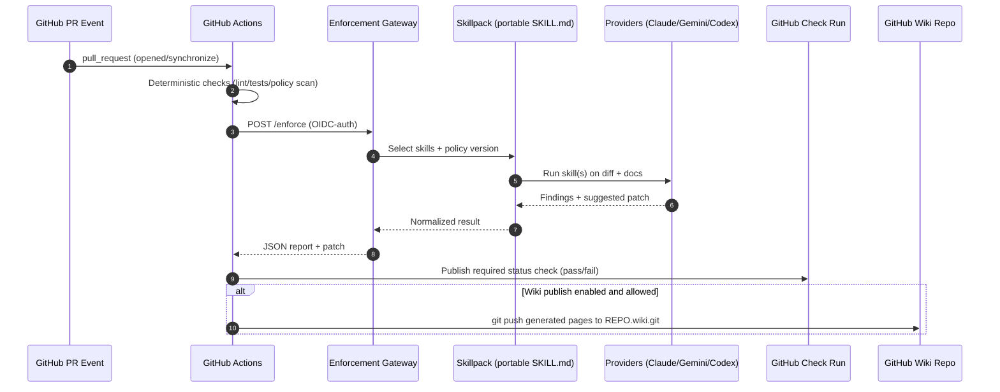

# Building Git‑Enforced Multi‑Model Skill Automation Inspired by Karpathy’s LLM Wiki

## Executive summary

Karpathy’s “LLM Wiki” artifact is a deliberately **code-light, instruction-heavy “idea file”**: instead of shipping an app, it describes a reusable pattern where an LLM incrementally **compiles raw sources into a persistent, interlinked markdown wiki** governed by a repo-level “schema” document (explicitly referencing `CLAUDE.md` for Claude Code and `AGENTS.md` for Codex). citeturn13view0 This differs from classic RAG by prioritizing **persistent synthesis** over rediscovery at query time. citeturn13view0

A concrete, reusable automation that leverages this pattern—and integrates Claude marketplace skills, Gemini skills, OpenAI Codex skills/plugins (or equivalents), and Git enforcement—works best as a **contract-first orchestration layer** triggered by **Git events** (pre-commit/pre-push locally; CI checks and PR bots centrally). The orchestration layer routes work to vendor-specific “skill runners” while exposing a single stable interface for: (1) **policy** (what must happen), (2) **evidence** (what changed and why), and (3) **enforcement** (block/allow/autofix).

Key feasibility findings:

- **Skill portability is converging**: Claude Skills, Codex Skills, and Google’s Gemini “Agent Skills” all use a folder + `SKILL.md` format with **progressive disclosure** (metadata always loaded; full instructions loaded when triggered). citeturn18view2turn16view0turn19view3turn8view1  
- **Marketplaces are JSON catalogs**: Claude Code uses `.claude-plugin/marketplace.json`. citeturn18view6 Codex uses `.agents/plugins/marketplace.json`. citeturn16view1 Copilot CLI uses `.github/plugin/marketplace.json`. citeturn11search1turn11search4  
- **GitHub Wiki publishing is fully scriptable**: the “Wiki” tab is backed by a separate Git repo (`REPO.wiki.git`), and only the default branch push is rendered live. citeturn4view0  
- **Enforcement should be CI-native**: local Git hooks are bypassable; branch protection + required status checks produce durable enforcement. citeturn26search14turn25view3turn25view4  

Assumptions (because the artifact was initially “unspecified”):
- Primary artifact = Karpathy’s GitHub Gist “LLM Wiki” created Apr 4, 2026. citeturn13view0  
- Secondary artifact (optional) = `karpathy/autoresearch` because it operationalizes “program the agent with markdown,” a design that complements skill-driven enforcement. citeturn15view0  
- “Claude Marketplace skills” = Claude Code plugin marketplaces and the Skills system inside Claude Code/plugins (not an unrelated third-party marketplace site). citeturn18view6turn18view5  
- “Gemini skills” = Google/Gemini ecosystem Agent Skills (e.g., `google-gemini/gemini-skills`) installable via skills tooling and usable alongside MCP. citeturn19view3turn8view1  

## Artifact catalog, official sources, and license constraints

### LLM Wiki gist

The “LLM Wiki” gist positions itself as an **idea file** intended to be copy-pasted into your agent so the agent can customize an implementation for your needs. citeturn13view0 It frames the core technique as a three-layer architecture (raw sources → wiki → schema/config). citeturn13view0 The schema is explicitly described as a document like `CLAUDE.md` or `AGENTS.md` that “disciplines” the agent’s maintenance workflow. citeturn13view0 It defines three operations—ingest, query, lint/health-check—plus conventions for indexes/logs and practical tooling (Obsidian, Dataview, etc.). citeturn13view0

**License constraint:** the gist content as shown does not include an explicit license statement in the file body. citeturn13view0 Practically, treat the idea as broadly reusable, but treat verbatim text reuse and redistribution more cautiously until a license is clarified.

### AutoResearch repo

`karpathy/autoresearch` presents an autonomous loop where an agent iterates code experiments while the human “programs the org” via a markdown file (`program.md`), explicitly comparing that file to a “super lightweight skill.” citeturn15view0 This is relevant to LLM Wiki automation because it demonstrates how to constrain autonomy (single file edit scope, fixed-time runs, measurable acceptance criteria). citeturn15view0

**License constraint:** README says “MIT,” but issues note there is no `LICENSE` file, making the grant ambiguous in practice. citeturn15view0turn23view0turn23view1

### Artifact summary table

| Artifact | Official source | What it contributes to your automation design | License / reuse note |
|---|---|---|---|
| LLM Wiki idea file | GitHub Gist (Apr 4, 2026) citeturn13view0 | Persistent synthesis pattern; repo schema file; ingest/query/lint workflows | No explicit license text observed in the gist body citeturn13view0 |
| AutoResearch | GitHub repo README (Mar 2026) citeturn15view0 | Practical constrained autonomy loop; “markdown-as-program” pattern | README claims MIT, but repo is repeatedly reported as missing a LICENSE file citeturn23view0turn23view1 |

image_group{"layout":"carousel","aspect_ratio":"16:9","query":["karpathy llm-wiki gist screenshot","karpathy autoresearch github repository screenshot","Claude Code plugin marketplace.json documentation screenshot","OpenAI Codex plugins build documentation screenshot"],"num_per_query":1}

## Marketplace ecosystems and integration models

### Converging “Agent Skills” format

Claude Skills are filesystem-based directories that can include instructions, executable code, and references, enabling **progressive disclosure** (metadata loaded at startup; full instructions loaded when triggered). citeturn18view2 Codex Skills explicitly build on the open agent skills standard and describe the same progressive disclosure behavior from the Codex side. citeturn16view0 Google’s Gemini “coding agents” guidance and the `google-gemini/gemini-skills` repo show a similar packaging approach and recommend pairing skills with an MCP documentation server for freshness. citeturn19view3turn8view1

This convergence supports a reusable strategy: **one canonical skill pack** + **thin vendor packaging layers**.

### Claude Code plugins and marketplaces

Claude Code marketplaces are defined by `.claude-plugin/marketplace.json` and can reference local directories or GitHub repos; the docs also note plugins are copied into a cache, so plugins cannot rely on `../` references outside their directory (symlinks are suggested for shared files). citeturn18view6 The plugin system bundles skills, agents, hooks, MCP servers, and more. citeturn18view5

Hooks are particularly relevant to enforcement: they are deterministic lifecycle triggers that can inspect tool calls and return allow/deny decisions. citeturn18view4turn24view0

### Codex plugins and marketplaces

Codex plugins are the installable unit bundling skills, app integrations, and MCP servers. citeturn16view2 Codex marketplaces are JSON catalogs discoverable from repo-scoped `.agents/plugins/marketplace.json` and personal `~/.agents/plugins/marketplace.json` locations. citeturn16view1 A minimal plugin is defined by `.codex-plugin/plugin.json`, and skills live under `skills/<name>/SKILL.md`. citeturn16view1

Codex also supports MCP extensively, including bearer token and OAuth auth for MCP servers, which matters for enterprise tool integration. citeturn20view1

### Gemini CLI skills, extensions, and MCP

Gemini CLI is open-source (Apache 2.0) and emphasizes MCP support, Google Search grounding, and GitHub integration via a dedicated GitHub Action. citeturn8view0 Google’s “coding assistant with Gemini MCP and Skills” doc recommends connecting to a hosted Gemini Docs MCP server and installing Gemini API skills; it explicitly notes skills can fall back to fetching `llms.txt` if MCP is not installed. citeturn19view3

The `google-gemini/gemini-skills` repository provides skills (Apache 2.0) but includes an explicit disclaimer that it is “not an officially supported Google product.” citeturn8view1

### Copilot CLI plugins, marketplaces, and Copilot Extensions

Copilot CLI supports plugin marketplaces via a `marketplace.json` catalog; docs describe storing it under `.github/plugin/marketplace.json` for discovery. citeturn11search1turn11search4 Separately, GitHub Copilot Extensions are presented as a partner ecosystem surfaced through GitHub Marketplace and IDE experiences. citeturn12view0turn11search0

### Marketplace comparison table

| Ecosystem | What you ship | Marketplace mechanism | Primary extension interface | Auth surface and notes | Operational pros/cons |
|---|---|---|---|---|---|
| Claude Code (Anthropic) | Plugins bundling skills/agents/hooks/MCP citeturn18view5 | `.claude-plugin/marketplace.json` citeturn18view6 | Skills (`SKILL.md`) + deterministic hooks citeturn18view2turn24view0 | Hooks can pass JSON, support command/HTTP/prompt/agent hook types citeturn24view0 | Great for local workflow enforcement; packaging caveat: plugin directory copied to cache citeturn18view6 |
| Codex (OpenAI) | Plugins bundling skills/apps/MCP citeturn16view2 | `.agents/plugins/marketplace.json` citeturn16view1 | Skills + Plugins + MCP + Agents SDK workflows citeturn16view0turn16view3turn20view1 | MCP supports bearer tokens and OAuth; `codex mcp login` for OAuth flows citeturn20view1 | Strong diff-aware patching and reviewable workflows; extra moving parts |
| Gemini (Google) | CLI + skills + MCP docs server citeturn8view0turn19view3 | Skill distribution via repos + skills tooling (skills.sh/Context7) citeturn19view3turn8view1 | Gemini API tools/function calling + “tool context circulation” citeturn21search1 | Gemini API rate limits are per project; RPD resets midnight PT citeturn19view1 | Excellent “freshness” via Search/MCP; adapters must preserve tool context fields citeturn21search1 |
| Copilot CLI (GitHub/Microsoft) | CLI plugins | `.github/plugin/marketplace.json` citeturn11search4 | CLI plugin interface + marketplace catalogs | GitHub API limits apply; GitHub App vs token differences matter for bots citeturn25view1turn25view2 | Useful for distribution inside org; not a hard CI gate by itself |
| GitHub Copilot Extensions | Partner apps for Copilot Chat citeturn12view0 | GitHub Marketplace listing citeturn11search0turn12view0 | Extension framework (partner ecosystem) | Typically involves OAuth/API integration (implementation-specific) | Great UX in IDE/GitHub.com; enforcement is indirect unless paired with required checks |

## Git enforcement architectures with multi‑model skills

### Enforcement points in the Git lifecycle

Client-side hooks (pre-commit/pre-push) run locally and can block commits, but they can be bypassed (`--no-verify`). citeturn26search14 Server-side hooks (pre-receive/update) exist in Git generally, but on hosted Git platforms you often can’t install arbitrary server-side scripts; GitHub Enterprise Server supports pre-receive hooks explicitly. citeturn6search2turn26search1

On GitHub-hosted repos, the durable enforcement mechanism is **branch protection + required status checks**: required checks must be successful (or skipped/neutral) to merge into protected branches. citeturn25view3turn25view4

### Architecture patterns that integrate skills/plugins across vendors

**Pattern A: Local developer “fast fail” (advisory)**
- Git pre-commit runs deterministic validation first (lint, schema checks).
- Optional: locally invoke a skill runner (Claude Code hook, Codex CLI noninteractive, Gemini CLI scripted run).
- Output: a structured result; block if policy fails locally, but rely on CI for guarantee.

Use this for: formatting, missing docs, “wiki page required” hints.
Key limitation: bypassable. citeturn26search14

**Pattern B: CI as the policy gate (recommended)**
- GitHub Action triggers on PR events. citeturn6search9  
- Run deterministic checks first.
- If policy requires semantic judgment, call an internal “LLM enforcement gateway” that routes to Claude/Gemini/Codex skills depending on task.
- Publish results as a check run; block merge via required status checks. citeturn25view3turn25view4  

**Pattern C: PR bot for UX + autofix (optional)**
- A GitHub App receives webhook events and posts review comments, suggested patches, or opens an “autofix” branch PR.
- Merge gating still controlled by required checks.

### Security and authentication choices

**GitHub side**
- Use `GITHUB_TOKEN` with least privileges where possible; docs recommend trimming permissions and using GitHub Apps or PATs if you need capabilities not present in `GITHUB_TOKEN`. citeturn25view0  
- For external services (your own gateway), use GitHub Actions OIDC to avoid long-lived secrets. citeturn2search2

**Model provider side**
- OpenAI rate limits are measured across RPM/RPD/TPM/TPD/IPM and are org/project scoped; there are also spend limits. citeturn19view0  
- Gemini rate limits are generally RPM/TPM/RPD, applied per project; daily quotas reset at midnight Pacific time. citeturn19view1  
- Claude API limits vary by tier; the rate limits doc describes token-bucket semantics and burst behavior. citeturn18view1  

**Cost signals**
- OpenAI publishes per-token and tool pricing, including explicit pricing for tools like web search and containers, and includes a Codex model price line under “Specialized models.” citeturn17view0  
- Gemini pricing distinguishes Free vs Paid and explicitly notes content usage differences (Free: content used to improve products; Paid: not used). citeturn19view2  
- Anthropic pricing docs recommend cost optimization strategies such as choosing models by task complexity, prompt caching, and batching. citeturn18view0  

### When GitHub Wiki is the publish target

GitHub wikis are Git repositories. Once an initial page exists, you can clone `https://github.com/OWNER/REPO.wiki.git`, commit/push changes, and only default-branch pushes are rendered live. citeturn4view0 You can generate `_Sidebar.*` and `_Footer.*` to control wiki navigation. citeturn5view0

This enables a “docs source of truth” pattern:
- Main repo stores raw docs + schema + generation logs.
- CI job builds wiki pages and pushes to the wiki repo.

## Reusable design patterns, schemas, and data flows

### Core pattern: contract-first orchestration

Because the skill formats and marketplace catalogs differ, the reusable layer should be **an internal contract** that:
- accepts Git events + repo policy + diff/doc context,
- invokes one or more “skills” across providers,
- returns a normalized compliance report with optional patches.

This supports vendor flexibility (Claude vs Gemini vs Codex) while keeping enforcement stable.

### Normalized message schema

A practical envelope for GitHub-triggered enforcement:

```json
{
  "request_id": "uuid",
  "idempotency_key": "owner/repo:sha:policy_version:skillpack_hash",
  "trigger": {
    "source": "github",
    "event": "pull_request",
    "repo": "owner/repo",
    "sha": "fullsha",
    "pr_number": 123,
    "actor": "login"
  },
  "inputs": {
    "changed_files": ["docs/...", "src/..."],
    "diff_unified": "…",
    "policy_docs": ["AGENTS.md", "CLAUDE.md", "GEMINI.md"],
    "wiki_target": {
      "enabled": true,
      "mode": "github_wiki",
      "wiki_git_url": "https://github.com/owner/repo.wiki.git"
    }
  },
  "constraints": {
    "max_latency_ms": 120000,
    "max_cost_usd": 3.00,
    "data_classification": "internal|restricted"
  },
  "observability": {
    "trace_id": "uuid",
    "span": "enforce",
    "emit_artifacts": true
  }
}
```

### Output schema (what Actions and bots consume)

```json
{
  "status": "pass|warn|fail",
  "annotations": [
    { "path": "docs/api.md", "line": 12, "severity": "error", "message": "Missing wiki update for new endpoint" }
  ],
  "patch": {
    "format": "unified_diff",
    "body": "diff --git …"
  },
  "provider_usage": [
    { "provider": "openai", "model": "gpt-5.3-codex", "input_tokens": 12345, "output_tokens": 2345, "latency_ms": 22000 }
  ]
}
```

### Idempotency and replay

Idempotency is essential because GitHub may deliver multiple events per PR update, and CI may rerun jobs. A stable idempotency key anchored on `repo + sha + policy_version + skillpack_hash` prevents duplicate model calls and duplicate wiki pushes.

For Gemini tool-combination workflows specifically, adapters must preserve tool context parts and critical fields (`id`, `tool_type`, `thought_signature`) to maintain state across turns. citeturn21search1

### Observability strategy

- Emit structured logs keyed by `request_id` and `trace_id`.
- Store artifacts: diffs analyzed, rendered reports, patches, and (if generating wiki) a page map.
- Track token usage and per-run cost using provider usage metadata; OpenAI and Gemini expose cost/usage constructs that correlate strongly with tokens and tool calls. citeturn17view0turn19view2

### Sequence diagram: PR gating with multi-model skills



### Mermaid flowchart: end-to-end enforcement pipeline

```mermaid
flowchart TD
  A[Git change: commit/PR] --> B{Enforcement layer}
  B -->|Local advisory| C[pre-commit / pre-push hooks]
  B -->|Central gate| D[GitHub Actions required check]
  B -->|UX layer| E[PR Bot (GitHub App)]

  C --> F[Deterministic checks]
  D --> F

  F --> G{Need semantic judgment?}
  G -->|No| H[Pass/fail immediately]
  G -->|Yes| I[Enforcement Gateway]

  I --> J[Select skillpack + version]
  J --> K{Route by task}
  K --> L[Claude Skills/Plugins]
  K --> M[Gemini Skills + MCP + tools]
  K --> N[Codex Skills/Plugins + MCP]

  L --> O[Normalized result]
  M --> O
  N --> O

  O --> P{Autofix allowed?}
  P -->|Yes| Q[Open autofix PR + patch]
  P -->|No| R[Comment + annotations]

  Q --> S[Branch protection merge gate]
  R --> S
  H --> S
```

Where screenshots would help (for a Phase 2 doc): GitHub Wiki tab cloning UI and `_Sidebar` behavior; a Claude Code marketplace install flow; Codex plugin directory UI; and an example GitHub “Checks” tab showing annotations.

## Implementation roadmap, effort, tests, and CI/CD

### Milestone-oriented plan

**Milestone: Baseline scaffolding**
- Create a canonical `skillpack/` repo (portable `SKILL.md` folders) and generate vendor packaging files:
  - `.claude-plugin/marketplace.json` for Claude Code distribution citeturn18view6  
  - `.agents/plugins/marketplace.json` + `.codex-plugin/plugin.json` for Codex citeturn16view1  
  - (optional) `.github/plugin/marketplace.json` for Copilot CLI plugin discovery citeturn11search4  
- Effort: ~3–5 engineering days.

**Milestone: CI enforcement MVP (no bots)**
- Add GitHub Action:
  - deterministic checks
  - call gateway (or single provider) for semantic checks
  - publish check run used by protected branch required checks citeturn25view3turn25view4  
- Use `GITHUB_TOKEN` with minimal permissions; escalate to GitHub App token if needed. citeturn25view0  
- Effort: ~1–2 weeks.

**Milestone: GitHub Wiki publishing**
- Add “publish wiki” job:
  - clone `https://github.com/OWNER/REPO.wiki.git` and push generated pages citeturn4view0  
  - generate `_Sidebar.*` and `_Footer.*` citeturn5view0  
- Effort: ~3–5 days (plus policy tuning for page taxonomy).

**Milestone: Multi-provider routing + cost controls**
- Implement routing: e.g., Codex for diffs/patches, Claude for policy reasoning and structured workflows, Gemini for freshness/tool-based checks.
- Add hard budgets: max USD / run; max tokens; concurrency caps; caching.
- Effort: ~2–4 weeks.

**Milestone: PR bot + autofix**
- GitHub App for webhook ingestion (PR events), comment posting, and optional autofix PRs.
- Effort: ~2–4 weeks.

### Testing strategies

- Golden test fixtures: input diff → expected JSON annotations; ensure deterministic behavior where possible.
- Adapter replay tests:
  - Gemini tool-combo state replay (must preserve returned tool parts and critical fields). citeturn21search1  
- Security tests:
  - prompt-injection fixtures in docs
  - secret leakage fixtures
  - malicious wiki content attempting to redirect policy

### Deployment

- Run the enforcement gateway as a small service; use GitHub Actions OIDC to authenticate without long-lived secrets. citeturn2search2  
- Store audit artifacts (reports/patches) with retention, keyed by idempotency key.

## Failure modes, mitigations, and compliance/privacy concerns

### Likely failure modes

- **Prompt injection from repo content** (docs or code attempt to override policy).
  - Mitigation: deterministic policy checks first; strict allowlists for tools; isolate “wiki publisher” permissions.
- **Flaky enforcement due to model nondeterminism**
  - Mitigation: cached/idempotent runs; structured output schemas; deterministic “lint” layer; keep LLM as “explain + propose patch,” not as single source of truth.
- **Rate-limit cascades / cost spikes**
  - Mitigation: concurrency caps; queueing; fallback providers; batching/caching (Claude cost optimization guidance; Gemini caching; OpenAI tool pricing awareness). citeturn18view0turn21search3turn17view0turn19view0turn19view1  
- **Wiki publish conflicts**
  - Mitigation: treat wiki as deploy target; serialize pushes; only push on merge to default branch; default branch is the live branch anyway. citeturn4view0  
- **Supply-chain risk in marketplaces**
  - Mitigation: internal curated marketplaces; pin versions; review plugins as code; note Claude Code plugin caching constraints that can hide dependencies if not packaged carefully. citeturn18view6  

### Privacy/compliance signals to plan for

- Gemini Free tier indicates content may be used to improve products; Paid indicates content not used to improve products—important for “restricted” repos. citeturn19view2  
- For MCP servers, prefer enterprise auth (bearer token, OAuth) and minimize data exposed; Codex MCP explicitly supports both. citeturn20view1  
- Store only what you need: avoid committing raw model transcripts into repo history unless you have a defined retention/compliance posture.

## Example snippets for key integrations

### GitHub Action skeleton for enforcement + wiki publish

```yaml
name: ai-enforcement

on:
  pull_request:
    types: [opened, synchronize, reopened, ready_for_review]

jobs:
  enforce:
    runs-on: ubuntu-latest
    permissions:
      contents: read
      pull-requests: write
      id-token: write   # for OIDC to your gateway
    steps:
      - uses: actions/checkout@v4

      - name: Deterministic checks
        run: ./scripts/policy_lint.sh

      - name: Call enforcement gateway
        env:
          ORCH_URL: ${{ secrets.ORCH_URL }}
        run: ./scripts/call_gateway_oidc.sh "$ORCH_URL"

  publish-wiki:
    if: github.event.pull_request.merged == true
    needs: enforce
    runs-on: ubuntu-latest
    permissions:
      contents: write
    steps:
      - uses: actions/checkout@v4
      - name: Generate wiki pages
        run: ./scripts/build_wiki_pages.sh

      - name: Push to GitHub Wiki repo
        run: |
          git clone "https://github.com/${{ github.repository }}.wiki.git" wiki_out
          rsync -a --delete ./generated_wiki/ wiki_out/
          cd wiki_out
          git add -A
          git commit -m "Update wiki from ${GITHUB_SHA}" || exit 0
          git push
```

Why this works: GitHub wikis can be cloned/pushed as `REPO.wiki.git`. citeturn4view0

### Webhook receiver pseudocode (PR bot / gateway trigger)

```python
def handle_webhook(headers, body_bytes):
    verify_github_signature(headers, body_bytes)

    event = headers.get("X-GitHub-Event")
    payload = json.loads(body_bytes)

    if event != "pull_request":
        return 200

    envelope = normalize_to_envelope(payload)
    # idempotency key: repo + sha + policy version
    enqueue(envelope["idempotency_key"], envelope)
    return 202
```

### Skill adapter interface (vendor-agnostic)

```python
class SkillRunner:
    def run(self, skill_ref: str, ctx: dict) -> dict:
        """
        Returns:
          status: pass|warn|fail
          annotations: [...]
          patch: optional unified diff
          provider_usage: tokens, latency
        """
        raise NotImplementedError()
```

### Claude Code hook example (deny unsafe writes)

Claude hooks receive JSON on stdin and can deny tool actions (e.g., PreToolUse). citeturn24view0

```bash
#!/usr/bin/env bash
payload="$(cat)"
tool="$(echo "$payload" | jq -r '.tool_name')"
cmd="$(echo "$payload" | jq -r '.tool_input.command // ""')"

if [[ "$tool" == "Bash" && "$cmd" =~ rm\ -rf\ .* ]]; then
  jq -n '{
    hookSpecificOutput: {
      hookEventName: "PreToolUse",
      permissionDecision: "deny",
      permissionDecisionReason: "Destructive command blocked by policy"
    }
  }'
  exit 0
fi

exit 0
```

## Phase two optional additions

Two optional Phase 2 components map naturally onto the above architecture without changing the core plan:

- **entity["company","VectifyAI","ai company"] PageIndex** as an MCP-backed “structured retrieval” subsystem for long PDFs and deep doc sets (vectorless tree indexing), integrated as a tool the gateway can call when “lint” or “wiki compile” needs traceable retrieval. citeturn27search0turn27search2turn27search4  
- **`mandel-macaque/memento`** as an auditability layer that attaches AI session transcripts to commits via git notes and includes a GitHub Action “gate” mode—useful if you want “AI provenance” enforced as part of PR checks. citeturn27search1turn27search3  

## Primary source links

```text
Karpathy LLM Wiki gist (Apr 4, 2026)
https://gist.github.com/karpathy/442a6bf555914893e9891c11519de94f

Karpathy AutoResearch repo
https://github.com/karpathy/autoresearch

Claude Code plugin marketplaces
https://code.claude.com/docs/en/plugin-marketplaces
Claude Code plugins reference
https://code.claude.com/docs/en/plugins-reference
Claude Code hooks guide + hooks reference
https://code.claude.com/docs/en/hooks-guide
https://code.claude.com/docs/en/hooks

Claude Agent Skills overview
https://platform.claude.com/docs/en/agents-and-tools/agent-skills/overview
Claude API pricing + rate limits
https://platform.claude.com/docs/en/about-claude/pricing
https://platform.claude.com/docs/en/api/rate-limits

Codex Agent Skills + plugins + marketplaces
https://developers.openai.com/codex/skills
https://developers.openai.com/codex/plugins
https://developers.openai.com/codex/plugins/build
Codex + Agents SDK (MCP orchestration)
https://developers.openai.com/codex/guides/agents-sdk
OpenAI pricing + rate limits
https://developers.openai.com/api/docs/pricing
https://developers.openai.com/api/docs/guides/rate-limits
OpenAI Docs MCP
https://developers.openai.com/learn/docs-mcp

Gemini CLI + Gemini skills + coding agent setup
https://github.com/google-gemini/gemini-cli
https://github.com/google-gemini/gemini-skills
https://ai.google.dev/gemini-api/docs/coding-agents
Gemini API rate limits + pricing + function calling/tool combo
https://ai.google.dev/gemini-api/docs/rate-limits
https://ai.google.dev/gemini-api/docs/pricing
https://ai.google.dev/gemini-api/docs/function-calling
https://ai.google.dev/gemini-api/docs/tool-combination

GitHub Wiki is a Git repo; clone/push .wiki.git; _Sidebar/_Footer
https://docs.github.com/en/communities/documenting-your-project-with-wikis/adding-or-editing-wiki-pages
https://docs.github.com/en/communities/documenting-your-project-with-wikis/creating-a-footer-or-sidebar-for-your-wiki
GitHub Actions auth (GITHUB_TOKEN) + OIDC
https://docs.github.com/en/actions/tutorials/authenticate-with-github_token
https://docs.github.com/actions/deployment/security-hardening-your-deployments/configuring-openid-connect-in-cloud-providers
Branch protection + required status checks
https://docs.github.com/en/repositories/configuring-branches-and-merges-in-your-repository/managing-protected-branches/about-protected-branches

Copilot CLI plugin marketplaces
https://docs.github.com/en/copilot/how-tos/copilot-cli/customize-copilot/plugins-marketplace
Copilot Extensions announcement
https://github.blog/news-insights/product-news/introducing-github-copilot-extensions/

MCP primary sources
https://modelcontextprotocol.io/docs/getting-started/intro
https://www.anthropic.com/news/model-context-protocol
https://developers.openai.com/api/docs/mcp/
```